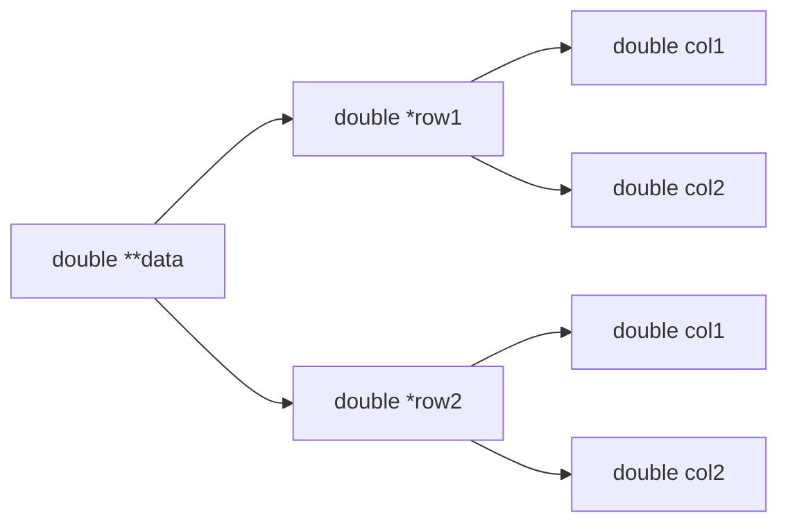
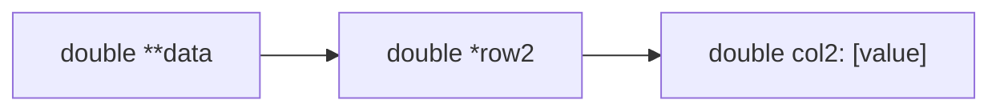
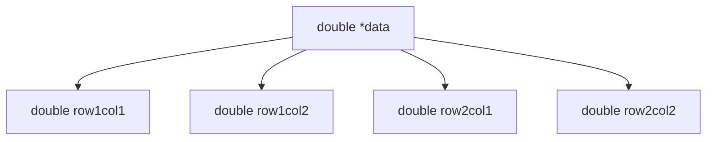
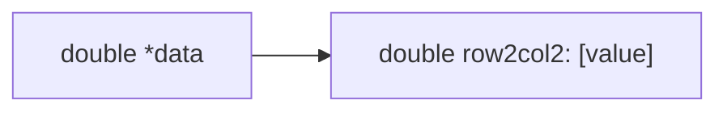

## Abstract

This article investigates the impact of memory layout on array traversal in the context of machine learning. A 1D array was compared against a 2D array, both representing a **1,000,000**$\times$**100** matrix. **53,046** paired measurements were collected over the span of **6 hours**, which were used to analyze execution times and apply statistical hypothesis testing. Results show that the 1D array consistently outpaced the 2D array by **~0.002734 seconds** per traversal, revealing a highly statistically significant difference (**p-value** $<$ **1e-323**). When applied in real-world scenarios relating to deep learning, these small performance gains translate into massive long-term benefits, potentially amounting to hours. This article highlights the implications of memory layouts in computational efficiency relating to data science workflows.

<!-- truncate -->

## Introduction

> Machine learning workflows revolve around processing massive datasets quickly and efficiently, which depends heavily on how the data is stored in memory.

[GeeksForGeeks](https://www.geeksforgeeks.org/pandas/python-pandas-dataframe/) (2025) formally define **DataFrames** as two-dimensional table-like structures where data is arranged into rows and columns. These data structures are a cornerstone of machine learning as they serve as a way to organize data, making it user-friendly while being computationally efficient.

But at the system level, to what extent do different memory layouts affect the training and inference time in machine learning workflows?

## Design Choices

I decided that the first step in building a machine learning library is to develop the DataFrame structure. Initially I thought that it would look something like:

```c
typedef struct {
    double **data;      // Data to be accessed by row-column indices
    int length;         // Number of rows/observations
    int nFeatures;      // Number of columns/features
    char **columnNames; // Human-readable identifiers for each column/feature
} DataFrame;
```

The current structure uses a double pointer (e.g., `**data`) to represent a traditional **2D matrix**, where each row is an array of numerical data:

<div id="f1.1" />


**Figure 1.1**: Traditional Matrix Layout

<div id="f1.2" />


**Figure 1.2**: Accessing Row 2, Column 2 using the Traditional Matrix Layout

As shown in [figure 1.2](#f1.2), accessing a datapoint involves two pointer dereferencing steps. Upon closer inspection, I realized that the steps can be reduced by removing the intermediate row pointer and flattening the 2D array into a **1D array**, while still having the array represent a matrix through arithmetic indexing. In summary, we can design it to function like a matrix on the surface, while being a 1D array at its core:

```C
typedef struct {
    double *data;       // Flat array to be accessed by arithmetic indexing
    int length;         // Number of rows/observations
    int nFeatures;      // Number of columns/features
    char **columnNames; // Human-readable identifiers for each column/feature
} DataFrame;
```

This structure now represents the matrix as a 1D array where each row is stored sequentially, which would result in faster access times as it no longer involves the intermediate row pointer dereferencing.

<div id="f1.3" />



**Figure 1.3**: 1D Array-based Matrix Layout

<div id="1.4" />



**Figure 1.4**: Accessing Row 2, Column 2 using the 1D Array-based Matrix Layout

Now we can access each datapoint without the extra row pointer. There is a caveat, however; readability is sacrificed for efficiency. Instead of having the straightforward `data[row][col]` indexing, since our matrix is 1D, we have to use a bit of arithmetic to access a target datapoint using the formula:

$$index = row_i \cdot col_n + col_j$$

Where $row_i$ is the target row; $col_n$ is the total number of columns; and $col_j$ is the target column.

But does the performance gain justify the sacrifice of simplicity and readability?

## Data Gathering

To observe the difference in performance between the two matrix designs, I wrote a simple code to measure how much time it takes to traverse through all datapoints in each array. I used `stdlib.h` for memory allocation and datatype conversions, `stdio.h` for outputs and logging, and `time.h` for measuring the time. I also defined parameters for the main function as we will use this to inject the external `runID` later in a bash script:

```c
#include <time.h>
#include <stdlib.h>
#include <stdio.h>

int main(int argc, char *argv[]);
```

I start by defining constants and using a fallback for the external `runID`. The `LENGTH` constant defines how much rows we have in each array. The `FEATURES` constant defines how many columns or features we have in each of the rows. Finally, the `REPEATS` constant defines how many times the program will traverse through the entire arrays. Note that the `REPEATS` constant serve as an inner loop; think of it as "Traverse the arrays `n` amount of times per program execution." We have a bash script that runs an external loop, executing the program another `k` amount of times.

In my case, I set `LENGTH` to a million entries, the `FEATURES` to a hundred columns, and the `REPEATS` to a thousand iterations. To put simply, I chose these numbers so that our array is large enough for the machine to not rely on cache. As for the `REPEATS`, this would help eliminate noise as we can get the average of each program execution. In total, **1,000,000 rows** and **100 columns** means we have **100,000,000,000 datapoints**:

```c
int runID = -1;
if (argc > 1) {
    runID = atoi(argv[1]);
}
// Define constants
int LENGTH = 1000000;
int FEATURES = 100;
int REPEATS = 1000;

// Allocate memory
double *arr1D = malloc(LENGTH * FEATURES * sizeof(double));
double **arr2D = malloc(LENGTH * sizeof(double*));
for (int i = 0; i < LENGTH; i++) {
    arr2D[i] = malloc(FEATURES * sizeof(double));
}
```

Following this, I wrote a simple loop to populate the respective arrays, with each value following the format `row.col` (e.g., `data[1][2] = 1.02`, `data[7][12] = 7.12`):

```c
void populateArr1D(double *arr, int length, int features) {
    for (int i = 0; i < length; i++) {
        for (int j = 0; j < features; j++) {
            arr[i * features + j] = i + j * 0.01;
        }
    }
}

void populateArr2D(double **arr, int length, int features) {
    for (int i = 0; i < length; i++) {
        for (int j = 0; j < features; j++) {
            arr[i][j] = i + j * 0.01;
        }
    }
}
```

Finally, I utilized the earlier `REPEATS` constant to repeatedly measure the time it takes to traverse each array. Notice how I used the `volatile` keyword on the `sum1D` and `sum2D` declarations; this prevents the compiler from optimizing access to the variable, consequently preventing unrelated optimization from skewing our benchmark results.

After consulting several [Stack Overflow threads](#references) as well as [Linux manual pages](#references), I decided to use the monotonic clock time over the CPU time for measuring array traversal speed. The `clock()` function measures the CPU time excluding time waiting for memory, which is not suitable for our use case. On the other hand, `clock_gettime(CLOCK_MONOTONIC)` measures wall-clock time while providing nanosecond precision, which makes it ideal for performance benchmarking. 

Lastly, I included the current timestamp in ISO8601 format for dataset credibility:

```c
for (int r = 0; r < REPEATS; r++) {
    // Volatile 
    volatile double sum1D = 0;
    volatile double sum2D = 0;

    // 1D and 2D Start and Stop timers
    struct timespec start1D, end1D;
    struct timespec start2D, end2D;

    // Current time
    time_t now = time(NULL);
    struct tm *t = localtime(&now);
    char buf[64];
    strftime(buf, sizeof(buf), "%Y-%m-%dT%H:%M:%S", t);

    // 1D
    clock_gettime(CLOCK_MONOTONIC, &start1D);
    for (int i = 0; i < LENGTH; i++) {
        for (int j = 0; j < FEATURES; j++) {
            sum1D += arr1D[i * FEATURES + j];
        }
    }
    clock_gettime(CLOCK_MONOTONIC, &end1D);

    // 2D
    clock_gettime(CLOCK_MONOTONIC, &start2D);
    for (int i = 0; i < LENGTH; i++) {
        for (int j = 0; j < FEATURES; j++) {
            sum2D += arr2D[i][j];
        }
    }
    clock_gettime(CLOCK_MONOTONIC, &end2D);

    // Compute elapsed time
    double elapsed1D = (end1D.tv_sec - start1D.tv_sec) +
        (end1D.tv_nsec - start1D.tv_nsec) / 1e9;

    double elapsed2D = (end2D.tv_sec - start2D.tv_sec) +
        (end2D.tv_nsec - start2D.tv_nsec) / 1e9;

    printf("%d,%s,%d,%f,%f\n", runID, buf, r, elapsed1D, elapsed2D);
    // Flush output stream to ensure clean data
    fflush(stdout);
}
```

Also, properly free the allocated memory after each program execution:

```c
// Free mallocs
free(arr1D);
for (int i = 0; i < LENGTH; i++) {
    free(arr2D[i]);
}
free(arr2D);
```

Lastly, I _aimed_ to execute the compiled program a thousand more in a controlled environment. I made sure to use the `TTY` instead of a desktop environment so that the C program does not fight for resources with other processes that may cause noise. Moreover, I ensured that it only ran on one CPU core while having the top priority:

```bash
#!/bin/bash
# Write column names to csv file
echo "RunID,Timestamp,IterationNumber,1D,2D" > data.csv
for i in {1..1000}; do
    echo "Running iteration $i"
    # taskset runs the program on CPU core #0
    # nice gives the program top priority
    # all output to stdout is redirected to a csv file
    taskset -c 0 nice -n -20 ./a.out $i >> data.csv
done
```

I left it running for approximately **6.3 hours** overnight, and came back to see that it has only ran **52 times** (excluding the last incomplete iteration). I overshot and realized that my current setup of is meant to yield **100 trillion** observations. Though it only ran **53 times**, it yielded **53,046 observations**, which should be more than enough.

<div id="f2.1" />

_You can [download the data from kaggle](#)!_

|       | RunID |      Timestamp      | IterationNumber |    1D    |    2D    |
| ----- | ----- | ------------------- | --------------- | -------- | -------- |
|   0   |   1   | 2025-09-10T01:00:18 |        0        | 0.221387 | 0.224860 |
|   1   |   1   | 2025-09-10T01:00:18 |        1        | 0.221286 | 0.224828 |
|  ...  |  ...  |         ...         |       ...       |    ...   |    ...   |
| 53046 |   54  | 2025-09-10T07:34:31 |        45       | 0.221656 | 0.223822 |

**Figure 2.1**: Preview of the gathered data

## Data Analysis

<div id="f3.1" />


**Figure 3.1**: Array traversal speed line plot

As shown in [figure 3.1](#f3.1), the raw data reveals a clear trend despite some noise, including two noticeable spikes in the 2D array timings. When aggregated into their respective `RunIDs`, the 1D array appears to have minor instability, nonetheless, it becomes clearer that the 1D array has faster times compared to the 2D array.

<div id="f3.2" />


**Figure 3.2**: Array difference plot

After running preprocessing steps to compute the differences between the two groups, it became clear that the 1D array's speed outpaces the 2D array's performance. As seen in the histogram of [figure 3.2](#f3.2), the 1D array proves to be faster by **0.00273 seconds** compared to the 2D array.

Initially, I thought of removing the outliers using the Interquartile Range (IQR) method. However, after running the analysis, **26,494 rows** out of a total **53,046 rows** were classified as outliers. I felt that this approach was too aggressive as it would remove a significant portion of our dataset, therefore, I decided to retain all data, including the outliers. This will preserve the integrity of our dataset without risking the loss of information. After all, with a sample size of **53,046**, our dataset should ideally be robust to outliers.

<div id="f3.3" />

| Statistic |  Raw 1D  |  Raw 2D  | Difference |
| --------- | -------- | -------- | ---------- |
|   mean    | 0.221200 | 0.223935 | -0.002734  |
|   std     | 0.000480 | 0.000345 |  0.000573  |
|   min     | 0.219484 | 0.221784 | -0.014332  |
|   25%     | 0.220871 | 0.223713 | -0.003119  |
|   50%     | 0.221153 | 0.223926 | -0.002766  |
|   75%     | 0.221478 | 0.224143 | -0.002378  |
|   max     | 0.223459 | 0.236197 |  0.000021  |

**Figure 3.3**: Summary statistics for raw data

As shown in [figure 3.3](#f3.3), the summary statistics for the raw data further reinforces the insights we drew from the earlier data visualization:
- The 1D array tends to be faster, with a mean execution time of **~0.2212 seconds** compared to the 2D array with a mean execution time of **~0.223935 seconds**, showing a gap of **~0.002734 seconds** per iteration.
- The standard deviation is slightly higher for the 1D array, indicating more variance and fluctuations in the access times. This might be due to cache behavior, though further tests would be required to confirm.
- The percentiles show that the 1D array was faster in **75%** of the tests. The maximum difference shows that the 2D array _barely_ outpaces the 1D array, but judging from the gap between the **75th** and **100th percentile**, this is likely an extreme outlier. Upon closer inspection, the maximum value is the only entry where the difference favors the 2D array:  
```python
df[df['Diff'] >= 0]

# Output:
# Index  RunID            Timestamp  IterationNumber        1D        2D      Diff
# 47907     48  2025-09-10T06:56:20              907  0.222312  0.222291  0.000021
```

## Hypothesis Testing

With **53,046 rows**, the dataset holds monstrous statistical power. To make good use of its potential, I ran a **left-tailed paired t-test** at a **0.05 significance level**:

```python
from scipy.stats import ttest_rel

alpha = 0.05
t_val, p_val = ttest_rel(df["1D"], df["2D"], alternative="less")

if (p_val > alpha):
    print(f"No statistical significance\nalpha {alpha} > p-value {p_val}")
else:
    print(f"Statistically significant\np-value {p_val} < alpha {alpha}")

# Output:
# Statistically significant
# p-value 0.0 < alpha 0.05
```

The **p-value of 0.0** seems unnatural. The first thought that came to mind was **floating point underflow**, a case where the floating point is extremely small for machine precision, so much so that it interprets the value as **0.0**. To verify my suspicions, I ran a loop that prints logarithmically shrinking values per iteration:

```python
for i in range(500):
    print(float("0." + ("0" * i) + "1"))
```

In my case, it only printed values up until **1e-323**, any smaller than that was printed as **0.0**. Further supporting my suspicion, this [Stack Overflow post](https://stackoverflow.com/questions/20530138/scipy-p-value-returns-0-0) describes a similar situation where the statistical function returns a p-value of **0.0**.

With these in mind, we can say that **p-value** $<$ **1e-323**. With a p-value that small, the mean difference of **-0.002734 seconds** is _extremely_ **statistically significant**. Proving that 1D arrays are faster than 2D arrays.

## Real-world Application

**0.002734 seconds** may seem like a negligible difference, especially for a dataset with the size of **100 million** elements. How relevant will this be in real-world problems?

Assume we are training a **RandomForest Classifier** with a dataset of **10,000 rows** and **10 features**. Suppose our model has **1000 trees** with a **depth of 6** and reads **60% (6) features** per tree.

$
6\text{ features} \times 1000\text{ trees} = 6000\frac{\text{reads}}{\text{row} \times \text{depth}} \\
6000\frac{\text{reads}}{\text{row} \times \text{depth}} \times 6\text{ depth} = 36,000\frac{reads}{row} \\
36,000\frac{reads}{row} \times 10,000\text{ rows} = 360,000,000\text{ total reads}
$

Training the model to our dataset would take **360 million** total reads. Now, to see how each respective array layout would perform, we first compute how much time it takes to read one element from our test of **100 million** elements, then multiply the resulting time by our **360 million** hypothetical reads:

$
\textbf{1D Array:} \\
\frac{0.221200\text{ s}}{100{,}000{,}000\text{ reads}} = 2.212\frac{\text{ns}}{\text{read}} \\
2.212\frac{\text{ns}}{\text{read}} \times 360{,}000{,}000\text{ reads} = 0.79632\text{ s}
$

$
\textbf{2D Array:} \\
0.223935\text{ s} / 100{,}000{,}000\text{ elements} = 2.23935\frac{\text{ns}}{\text{read}} \\
2.23935\frac{\text{ns}}{\text{read}} \times 360{,}000{,}000\text{ reads} = 0.806166\text{ s}
$

$
\textbf{Difference:} \\
0.79632\text{ s} - 0.806166\text{ s} = -0.009846\text{ s} \\
\therefore \text{the 1D array is faster by } 9.846\text{ ms}
$

The time savings grow in proportion with the total amount of reads made by the model. While it still may seem minimal at the scale of classic models, these savings suddenly matter a lot when dealing with neural networks and transformers, which does billions to trillions of reads per inference. Take for example, a neural network with **1 billion parameters**. Typically, the model will read approximately **1 billion parameters per inference**, so if we wanted to run **1 millon inferences**, that would sum up to **1 quadrillion reads**.

If we save **0.002734 seconds per 100 million reads**, then for **1 billion reads** and **1 million inferences**:

$
\frac{0.002734\text{ s}}{100{,}000{,}000\text{ reads}} = 27.34\text{ ps} \\
27.34\text{ ps} \times 1{,}000{,}000{,}000\text{ reads} = 0.02734\text{ s} \\
0.02734\text{ s} \times 1{,}000{,}000\text{ inferences} = 27{,}340\text{ s} \\
27{,}340\text{ s} \approx 7.6\text{ hours}
$

Our minimal savings of **0.002734 seconds** would become **7.6 hours** when applied in more complex deep learning models.

## Conclusion

The DataFrame's memory layout affects the model's efficiency, training time, and inference time. In an effort to find out which memory layout works fastest, the traversal time of a **1,000,000**$\times$**100** matrix represented as a 1D array and a 2D array was measured of **1,000**$\times$**1,000** inner and outer loops. 

The data was gathered in a controlled environment with minimal processes, which ran over the course of approximately **6.3 hours** and yielded **53,046 observations**. A left-tailed paired t-test was conducted to validate statistical significance, which has shown that the difference is _extremely_ significant, resulting in a p-value of less than **1e-323**. 

Data analysis shows that the 1D array outpaces the 2D array by **0.002734 seconds** at this scale. Further hypothetical computations show that this small gain grows into approximately **7.6 hours** of saved time when used in modern deep learning applications.

Such performance gain, even if mere nanoseconds feel ignorable at such a small scale, can yield massive long-term gains when applied on bigger scenarios. In summary, the **readability-efficiency tradeoff** is well worth considering as it can yield significant performance benefits in data science workflows.

## References

1. **clock(3) - Linux manual page.** _man7.org_. (n.d.). https://man7.org/linux/man-pages/man3/clock.3.html
2. **clock_gettime(3) — Linux manual page.** _man7.org_. (n.d.). https://www.man7.org/linux/man-pages/man3/clock_gettime.3.html
3. **Measure time in linux - time vs Clock vs getrusage vs clock_gettime vs Gettimeofday vs timespec_get?.** _Stack Overflow_. (2013a, April 17). https://stackoverflow.com/questions/12392278/measure-time-in-linux-time-vs-clock-vs-getrusage-vs-clock-gettime-vs-gettimeof
4. **Pandas dataframe.** _GeeksforGeeks_. (2025a, July 26). https://www.geeksforgeeks.org/pandas/python-pandas-dataframe/
5. **Random Forest algorithm in machine learning.** _GeeksforGeeks_. (2025, September 1). https://www.geeksforgeeks.org/machine-learning/random-forest-algorithm-in-machine-learning/ 
6. **Scipy P-value returns 0.0.** _Stack Overflow_. (2013b, December 11). https://stackoverflow.com/questions/20530138/scipy-p-value-returns-0-0 
